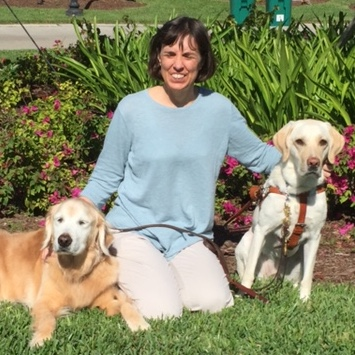
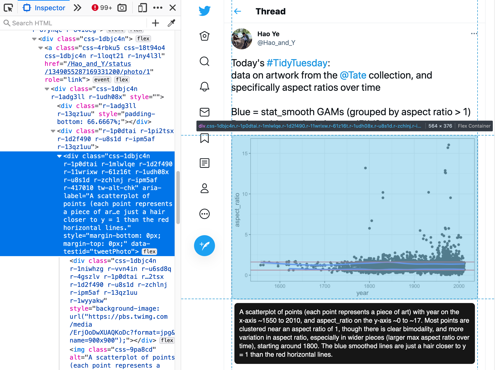

```{r metadata, echo=FALSE}
# creating HTML metadata to accompany the slides
library(metathis)
meta() %>%
  meta_general(
    description = "Revealing Room for Improvement in Accessibility within a Social Media Data Visualization Learning Community",
    generator = "xaringan and remark.js"
  ) %>% 
  meta_name("github-repo" = "spcanelon/csvConf2021") %>% 
  meta_social(
    title = "2021 csv,conf,v6 | Silvia Canelón & Liz Hare",
    url = "https://spcanelon.github.io/csvConf2021/slides",
    image = "coverImageSlide.png",
    image_alt = "Title slide for the talk presentation",
    og_type = "website",
    og_author = "Silvia Canelón & Liz Hare",
    twitter_card_type = "summary_large_image",
    twitter_creator = "@spcanelon"
  )
```

```{r setup, include=FALSE, eval = TRUE}
# loading libraries
library(tidyverse)
library(knitr)
library(showtext) # use various fonts in R graphs
library(fontawesome) # icons
library(xaringanExtra) # extra xaringan features
library(TidyTuesdayAltText)
library(gtsummary)

# specifying xaringanExtra features
xaringanExtra::use_xaringan_extra(c("tile_view",
                                    "panelset",
                                    "share_again"))

# enabling audible tone for slide transitions
# xaringanExtra::use_slide_tone()

# turning off scientific notation
options(scipen = 999)

# setting knitr code chunk options
knitr::opts_chunk$set(collapse = TRUE,
                      fig.retina = 3,
                      cache = FALSE,
                      warning = FALSE,
                      message = FALSE,
                      echo = FALSE,
                      comment = NA,
                      dpi = 300,
                      fig.align = "center")
```


```{r data-import}
tweets <- read_rds("data/tweets.Rds")
plotlineGraph <- read_rds("data/plot.Rds")
```


name: titleSlide
class: middle, title-slide

<!--Talk info: Session 0, May 4, 2021 from 10:20 AM to 10:40 PM-->

.left-col-narrow[.center[
```{r out.width="70%", eval=TRUE, fig.alt='Square CSV Conf logo featuring a black comma against a yellow background'}

```
`r rmarkdown::metadata$subtitle`
]]

.right-col-wide[
.left[
# Revealing Room for Improvement in Accessibility within a Social Media<br>Data Visualization Learning Community
]]

----

.right-col-wide[
.left[
.pull-left-equal[
### Silvia Canelón, PhD<br> @spcanelon `r fontawesome::fa("twitter")`
]

.pull-right-equal[
### Liz Hare, PhD<br>@DogGeneticsLLC `r fontawesome::fa("twitter")`

]
]]

???

---
exclude: true

# Outline (for internal use)

.pull-left-equal[
* [Title slide](#titleSlide)
* [Who are we?](#hello)
* [Takeaways](#takeaways)
* [Motivation](#motivation)
* [TidyTuesday data collection](#analysisDataCollection)
* [Alt text data collection](#analysisAltText)
* [Findings](#analysisResults)
]

.pull-right-equal[
* [Other places lacking alt-text](#otherPlaces)
* [Things are changing](#shiftingTide)
* [Good alt text](#goodAltText)
* [Learning resources](#learningResources)
* [Goodbye slide](#goodbye)
]

---
layout: true

<!--this adds the link footer to all slides, depends on footer-link class in css-->

<a class="footer-link" href="http://bit.ly/TidyTuesday"><strong>bit.ly/TidyTuesday</strong>
&#8226; Silvia Canelón & Liz Hare &#8226; csv,conf,v6</a>

???

---
name: hello
class: middle, center

# Who are we?

.pull-left-equal[

.center[

<!--HTML code inserting a circular avatar of a square photo-->


**Silvia Canelón**<br>
Postdoctoral Research Scientist<br>University of Pennsylvania
]]

.pull-right-equal[
.center[

<!--HTML code inserting a circular avatar of a square photo-->


**Liz Hare**<br>
Canine Genetics and Genomics Consultant<br>Dog Genetics, LLC
]]

???

---
name: takeaways
class: middle, highlight-last-item

# Takeaways

----

--

* Growth in online learning communities for data science

--

* TidyTuesday: Weekly social project for data visualization in R

--

* 3% of the data visualizations shared on Twitter had alternative text

--

* 84% were described by default as "Image"  


???
Why they shouldn't just repeat what's in the title or caption (in some documents, those thext elements will already be accessible, and they are not adequate to understand what the results.

---
name: motivation
class: middle, highlight-last-item

# Can blind people participate in data viz<br>learning communities?

--

* Why do blind people need data visualization?

--

  * Scientific communication
  * [Election maps](https://fossheim.io/writing/posts/accessible-dataviz-us-elections/)
  * [COVID-19 incidence maps & dashboards](https://www.theguardian.com/society/2020/sep/30/visually-impaired-scots-get-sonic-help-with-covid-graphs)
  * [Quorum](https://quorumlanguage.com/evidence.html) or [SAS](https://documentation.sas.com/doc/en/pgmsascdc/9.4_3.5/odsacoutput/n12hxbdrtzec6gn1k913nwfl9o4d.htm) can produce readable charts, but [R](https://cran.r-project.org)/[RStudio]() cannot
  
--
  
* Screen readers provide voice or braille access to computer text, **not images**

--

* AI image descriptions **cannot adequately describe data viz**

--

* Can blind people participate in #TidyTuesday?

---
name: TidyTuesday
class: middle, highlight-last-item

.pull-left-equal[
# What is TidyTuesday?

* [Social project](https://github.com/rfordatascience/tidytuesday) providing a new<br>tidy dataset every week
* Online data viz [R learning community](https://www.rfordatasci.com)
* Opportunity to practice summarizing<br>and visualizing data with [modern tooling](https://www.rfordatasci.com)

]

--

.pull-right-equal[

<blockquote class="twitter-tweet"><p lang="en" dir="ltr">The <a href="https://twitter.com/R4DScommunity?ref_src=twsrc%5Etfw">@R4DScommunity</a> welcomes you to week 19 of <a href="https://twitter.com/hashtag/TidyTuesday?src=hash&amp;ref_src=twsrc%5Etfw">#TidyTuesday</a>! We&#39;re exploring water access points!<br><br>📂 <a href="https://t.co/sElb4fcv3u">https://t.co/sElb4fcv3u</a><br>📰 <a href="https://t.co/feZnKx4KJE">https://t.co/feZnKx4KJE</a><a href="https://twitter.com/hashtag/r4ds?src=hash&amp;ref_src=twsrc%5Etfw">#r4ds</a> <a href="https://twitter.com/hashtag/tidyverse?src=hash&amp;ref_src=twsrc%5Etfw">#tidyverse</a> <a href="https://twitter.com/hashtag/rstats?src=hash&amp;ref_src=twsrc%5Etfw">#rstats</a> <a href="https://twitter.com/hashtag/dataviz?src=hash&amp;ref_src=twsrc%5Etfw">#dataviz</a> <a href="https://t.co/aN6TKtmsjw">pic.twitter.com/aN6TKtmsjw</a></p>&mdash; Tom Mock 💉💉🎉 (@thomas_mock) <a href="https://twitter.com/thomas_mock/status/1389400894224076802?ref_src=twsrc%5Etfw">May 4, 2021</a></blockquote> <script async src="https://platform.twitter.com/widgets.js" charset="utf-8"></script> 

]

---
name: TidyTuesdayExample
class: middle

.pull-left[
<blockquote class="twitter-tweet"><p lang="en" dir="ltr">Today&#39;s <a href="https://twitter.com/hashtag/TidyTuesday?src=hash&amp;ref_src=twsrc%5Etfw">#TidyTuesday</a>:<br>data on artwork from the <a href="https://twitter.com/Tate?ref_src=twsrc%5Etfw">@Tate</a> collection, and specifically aspect ratios over time<br><br>Blue = stat_smooth GAMs (grouped by aspect ratio &gt; 1)<br>Red = golden ratio (±1 + sqrt(5))/2 <a href="https://t.co/PSuBgUp3Ky">pic.twitter.com/PSuBgUp3Ky</a></p>&mdash; Hao Ye (@Hao_and_Y) <a href="https://twitter.com/Hao_and_Y/status/1349055287169331200?ref_src=twsrc%5Etfw">January 12, 2021</a></blockquote> <script async src="https://platform.twitter.com/widgets.js" charset="utf-8"></script> 
]

--

.pull-right[
# What do #TidyTuesday visualization tweets include?

* Verbal description
  * author's interest
  * learning process
  * interpretation of the data
* Link to the author's source code
* Data visualization attached as an image
* Alt-text for the image (rarely)
]

---
name: analysisAltText
class: middle

# How were the data collected?

--

.left-column[
Tweets collected & [made available](https://github.com/rfordatascience/tidytuesday) by Tom Mock using [rtweet](https://docs.ropensci.org/rtweet/)

----

Alt text scraped by Silvia Canelón using [RSelenium](https://docs.ropensci.org/RSelenium/) & available in the [TidyTuesdayAltText](https://github.com/spcanelon/TidyTuesdayAltText) `r emo::ji("package")`
]

--




---
name: analysisResultsLine
class: middle

# What did we find?

--

> ## Over the 3 years of TidyTuesday, there were 7,136 data viz tweets and **only 215 (3%) of them had alt-text**<br>
[Summary of these findings](https://spcanelon.github.io/csvConf2021/TidyTuesdayAltTextDescriptive3.html#Summary-how-many-tidytuesday-posts-have-alt-text)

---
class: top

.left-col-narrow[
.my-gray[Participation in TidyTuesday] has increased over time but **use of alt-text is recent and remains low**


<br><br><br><br><br>
The [conversation on Twitter](https://twitter.com/spcanelon/status/1375222124365946881?s=20)
]

.right-col-wide[

```{r line-graph, out.width="100%", fig.height=5, fig.align='left', fig.alt="Two line graphs shown on the same chart for comparison. The x axis is time and includes April 2018 through April 2021, and the y axis is the number of tweets per week. One of the line graphs corresponds to all TidyTuesday data viz tweets and over time there has been a gradual trend upwards indicating growing participation in TidyTuesday. This line is a light color and values range from 1 to 115 tweets. The second line graph corresponds to only those TidyTuesday data viz tweets that included alt-text and is a bolder line of a dark color. It ranges from 0 to 28 tweets. There has not been much of a trend upwards over time except very recently, coinciding with Liz and Silvia sharing their preliminary findings on Twitter in anticipation of the CSV Conf 2021 talk. This happened on March 25, 2021 and is annotated with text and an arrow on the plot."}

# adding annotations to saved plot object "plotlineGraph" in order to gauge size and placement on slide
plotlineGraph +
  annotate(
    geom = "text",
    label = "Preliminary findings\nshared on Twitter\nMarch 25, 2021",
    hjust = "left",
    x = as.Date("2020-03-01"),
    y = 25,
    color = "#121824"
    ) +
  # adding annotation arrow
  annotate(
    geom = "curve",
    x = as.Date('2020-08-01'),
    xend = as.Date("2021-03-10"),
    y = 35,
    yend = 28,
    curvature = -.5,
    arrow = arrow(
      length = unit(2, "mm"),
      type = "closed"),
    color = "#121824"
  ) +
  # adding y-axis annotation for all tweets together
  annotate(
    geom = "text",
    label = "All\ndata viz\ntweets",
    hjust = "left",
    x = as.Date("2021-04-30"),
    y = 79,
    color = "#9c9c9c",
    angle = 0
  ) +
  # adding y-axis annotation for alt-text tweets
  annotate(
    geom = "text",
    label = "Alt-text\ntweets",
    hjust = "left",
    x = as.Date("2021-04-30"),
    y = 22,
    color = "#121824", 
    angle = 0
  ) +
  # making adjustments so the y-axis annotations are allowed to expand beyond the predefined box created for the ggplot
  coord_cartesian(clip= 'off') +
  theme(plot.margin= margin(25, 25, 10, 25))
```
]

---
name: otherPlaces
class: middle, highlight-last-item

# Where else is alt-text missing?

--

* R books made available freely online

--

* R books made available digitally to people with print disabilities by [Bookshare](https://www.bookshare.org/cms/)   

--

* R package documentation  

--

* R blogs

--

----

.right[
This shows up at the individual-level and at the<br> corporate-level (e.g. RStudio R Markdown documentation)
]

---
name: analysisResultsRubric
class: middle

# What makes good alt-text?

--

### There were 196 data visualization tweets with relevant alt-text
<br>
``` {r, rubric table, results="asis", echo=FALSE}
meaning <- c(1, "Description conveys meaning in the data", "34%")
axis1 <- c(2, "Variables included on the axes", "28%")
axis2 <- c(3, "Scale described within the description", "12%")
plotType <- c(4, "Type of plot is described", "56%")
tab3 <- data.frame(rbind(meaning, axis1, axis2, plotType))
colnames(tab3) <- c("", "Alt-text Feature", "")
kable(tab3, row.names=FALSE)

```

---
name: shiftingTide
class: left, middle, highlight-last-item

# Has the tide started shifting?

----

--

* Conversations are happening
  * Within R: [useR!2021](https://user2021.r-project.org/participation/accessibility/), [MiR](https://mircommunity.com/about/), [TidyTuesday](https://themockup.blog/posts/2021-04-01-three-years-of-tidytuesday/)
  * More broadly: [Data Visualization Society](https://www.outlierconf.com/), [a11y](https://www.a11yproject.com/) conferences/meetups
  
--

* Tooling is slowly receiving updates
  * [New alt text code chunk option](https://blog.rstudio.com/2021/04/20/knitr-fig-alt/) for R Markdown
  
--

* Changes are just starting and slow

---
name: learningResources
class: middle, highlight-last-item

# What can you do?

--

.pull-left[

* **Make your data visualizations accessible everywhere you can**

* **Add alt-text** to websites, journalism, scientific publishing, social media

* **Find ways to describe your visualizations** in words when<br>alt-text isn't available in your documents or platforms 
]

--

.pull-right-equal[
Data visualization alt-text resources

*	[Writing alt-text for data visualization](https://medium.com/nightingale/writing-alt-text-for-data-visualization-2a218ef43f81)
* [Chartability Data Viz Audit Workbook](https://chartability.fizz.studio/)
* [a11y Data Viz Accessibility Resources](https://github.com/dataviza11y/resources/blob/main/README.md)

Tools for Twitter

* [How to make images accessible for people](https://help.twitter.com/en/using-twitter/picture-descriptions)
* Show alt-text for tweets: [Firefox](https://addons.mozilla.org/en-US/firefox/addon/alt-or-not/)
* Twitter reminder to add alt-text: [Firefox](https://addons.mozilla.org/en-GB/firefox/addon/twitter-required-alt-text/)
]

---
name: goodbye
class: left, bottom
layout: false

.left-col-narrow[

# Thanks!

[Analysis repo & resources](https://github.com/spcanelon/csvConf2021) `r fontawesome::fa("github")`

.footnote[
This presentation was made using<br>the [xaringan](https://github.com/yihui/xaringan#xaringan), and   [xaringanExtra](https://github.com/gadenbuie/xaringanExtra#xaringanextra) R packages.
]

]<!--end of left-col-narrow-->

.right-col-wide[

.pull-left-equal[
.right[
<!--HTML code inserting a circular avatar of a square photo-->


Silvia Canelón, PhD

<!--Inserting social media links-->
[`r fontawesome::fa("link")` silvia.rbind.io](https://silvia.rbind.io)<br>
[`r fontawesome::fa("twitter")` @spcanelon](https://twitter.com/spcanelon)<br>
[`r fontawesome::fa("github")` @spcanelon](https://github.com/spcanelon)<br>

]
]<!--end of pull-left-equal-->

.pull-right-equal[
.right[
<!--HTML code inserting a circular avatar of a square photo-->


Liz Hare, PhD

<!--Inserting social media links-->
[`r fontawesome::fa("link")` doggenetics.com](http://doggenetics.com/)<br>
[`r fontawesome::fa("twitter")` @DogGeneticsLLC](https://twitter.com/DogGeneticsLLC)<br>
[`r fontawesome::fa("github")` @LizHareDogs](https://github.com/LizHareDogs)<br>
[`r fontawesome::fa("envelope")` LizHare@DogGenetics.com](mailto:LizHare@DogGenetics.com)
]]<!--end of pull-right-equal-->
]<!--end of right-col-wide-->
